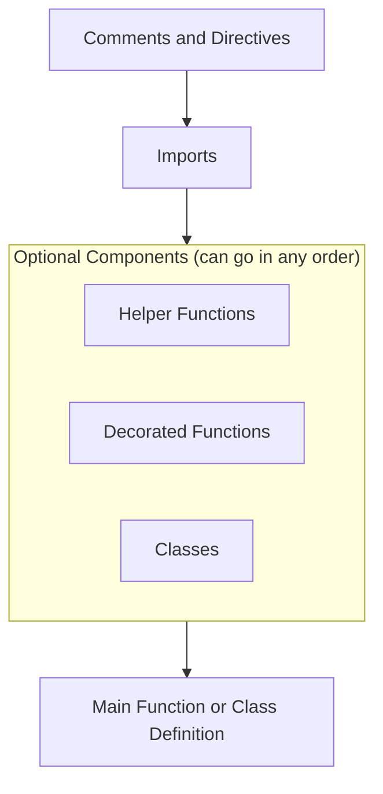

The general code structure of an indicator 'module' looks like this:



Syntactically, Indie code is a Python code. But, there are some
[differences](Language-differences-with-Python) that you may want to be aware about.

# Comment directives

Comment directives are special comments that have some effect on how Indie's compiler and/or runtime works.
At the moment there is only one comment directive which is:

```py
# indie:lang_version = 4
```

and it declares the language version of the source code of the indicator.

# Imports

The IMPORTS section consists of several `import` statements. Every `import` statement tells Indie runtime to import
(or connect) one or more symbols from [libraries](Library-reference). After that these symbols may
be used in the indicator code.

```py
from indie import indicator  # This line imports the `indicator`
                             # decorator from `indie` library package

@indicator('Example')  # Here we use the imported `indicator` decorator
def Main(self):
    # ...
```

Like in Python, there are several different forms of imports:

```py
import indie.algorithms  # Then you can use any symbols from this package
                         # with their full name, e.g. `indie.algorithms.Sma`

import indie.algorithms as alg  # Then you can use any symbols from this package
                                # with a short package alias, e.g. `alg.Sma`

from indie.algorithms import Sma  # Then you can use only `Sma` symbol from
                                  # this package (without the package prefix)

from indie.algorithms import Sma as my_sma  # Then you can use the symbol
                                            # with an alias `my_sma`
```

Also in every `from` form you are allowed to use lists of symbols, for example:

```py
from indie.algorithms import Sma, Wma, Ema
from indie.algorithms import Sma as s, Wma as w, Ema as e  # You can do this, but this is not a
                                                           # good coding style! Because this makes
                                                           # your code harder to read and understand
```

One note about the aliases. Do not use them if you do not really need them. And you most certainly will need them in two
cases:

- You have a name clash of two symbols from different libraries. Add an alias to one or both of the symbols to
  resolve the clash. For example:

```py
from some.library import foobar_func
from another.library import foobar_func
```

Obviously, when you try to call the imported function `foobar_func()` afterwards, it is unclear which one of the two
imported functions should be called. Such code cannot be run and produces an error.

Same example with a name clash resolved:

```py
from some.library import foobar_func
from another.library import foobar_func as another_foobar_func
# Now you may call both `foobar_func()` and `another_foobar_func()` without any ambiguity
```

- You import a symbol with a long name, and it is very uncomfortable to use that long name in the code:

```py
from some.library import some_useful_function_with_a_very_long_name
# Call the function later as `some_useful_function_with_a_very_long_name()`
```

Instead, it is better to use an alias:

```py
from some.library import some_useful_function_with_a_very_long_name as useful_func
# Call the function later as `useful_func()`
```

# Helper function definitions

Indicator algorithms could be quite complex, so it is a good coding style to extract blocks of code into
helper functions with some meaningful names. The minimal function that accepts no arguments, does nothing
(Python keyword `pass` is about that) and returns nothing (`None`) looks like this:

```py
def minimal_helper_func() -> None:
    pass
```

Obviously there will be not much help of such a helper function like `minimal_helper_func`, it's just an example.
Here is a more realistic example of a function that calculates a maximum of given two integers:

```py
def max(a: int, b: int) -> int:
    if a > b:
        return a
    else:
        return b
```

At the moment, it is mandatory to declare type hints for every argument as well as for the return value of all the
functions (except for the `Main` function and `@sec_context`-decorated functions). Read more about typing in the
[Data types in Indie](Data-types-in-Indie) chapter.

# Decorated helper function definitions

There are two decorators that can be applied to helper functions: `@algorithm` and `@sec_context`. Both of them are
syntactic sugar decorators which help a lot in making indicator code compact and readable.

The `@algorithm` decorator is a syntactic sugar for making your own
[series processing algorithm](Algorithms-for-series-processing) like `indie.algorithms.Sma`.

```py
@algorithm
def SomeFunc(self) -> SeriesF:
    # Some code...
```

The `@sec_context` decorator is a syntactic sugar for making an extra entry point function (like a secondary `Main`) for
additional instrument that indicator may request. This function should be used in combination with a `Context.calc_on`
function. Read more about it in [Request additional instruments](Request-additional-instruments).

```py
@sec_context
def SomeSecContext(self):
    # Some code, that processes the BINANCEUS:BTC/USD candles data...

@indicator('Example')
class Main(MainContext):
    def __init__(self):
        self._sec_context_res = self.calc_on(SomeSecContext, exchange='BINANCEUS', ticker='BTC/USD')

    def calc(self):
        # Some code that uses self._sec_context_res
```

# Class definitions

From Indie v4 the language partially supports [OOP](https://en.wikipedia.org/wiki/Object-oriented_programming) and this
support is going to be expanded. At the moment this means that Indie has `class` keyword that lets to declare classes,
just like in Python.

For example the `Main` entry point could be declared not as a function, but as a class, like this:

```py
# indie:lang_version = 4
from indie import indicator, MainContext

@indicator('Example')
class Main(MainContext):
    def calc(self):
        return self.close[0]
```

Constructor (the `__init__` method) could be optionally added too. It is very useful because it is a good place for some
initialization code that must be executed only once. For example:

```py
# indie:lang_version = 4
from indie import indicator, MainContext, IndieError

@indicator('Example')
class Main(MainContext):
    def __init__(self):
        # This code is executed only once at the creation
        # of the indicator before calculations on candle data
        c: str
        if 'EUR' in self.info.ticker:
            c = 'EUR'
        elif 'JPY' in self.info.ticker:
            c = 'JPY'
        elif 'USD' in self.info.ticker:
            c = 'USD'
        else:
            raise IndieError('This indie cannot be added on ' + self.info.ticker + ' chart')
        self._currency = c

    def calc(self):
        # Calculations on candle data are here
        # TODO: Use `self._currency` somehow here...
        return self.close[0]
```

Secondary contexts can be declared as classes (instead of using `@sec_context` decorator on a func) in a similar way,
for example:

```py
# indie:lang_version = 4
from indie import SecContext

class SecHighLow(SecContext):
    def calc(self):
        return self.high[0], self.low[0]
```

Finally, algorithms (instead of using `@algorithm` decorator on a func) can be declared as classes too, for example:

```py
# indie:lang_version = 4
from indie import Algorithm, Context, SeriesF, MutSeriesF

class MyAlgorithm(Algorithm):
    def __init__(self, ctx: Context):
        super().__init__(ctx)

    def calc(self, src1: SeriesF, src2: SeriesF) -> SeriesF:
        return MutSeriesF.new(src1[0] + src2[0])
```

# Main function or class definition

```py
@indicator('Example 1')
def Main(self):
    # Some code here...
```

The `Main` entry point of the whole indicator is mandatory. It is called every time the indicator receives a candle data
update and it should return an indicator result for that piece of data. It must have at least one parameter `self` which
is a reference to object of `Main` class (inherited from [`MainContext`](Library-reference#class_MainContext) type).
Function or class `Main` must also be decorated with a [`@indicator`](Library-reference#decor_indicator) decorator. But
also other decorators could be added here, for example:

- Decorator [`@plot`](Library-reference#decor_plot)
- Decorators [`@fill`, `@level` and `@band`](Fills-levels-and-bands)
- Decorators [`@param.*`](Input-parameters) for declaring input parameters of an indicator
